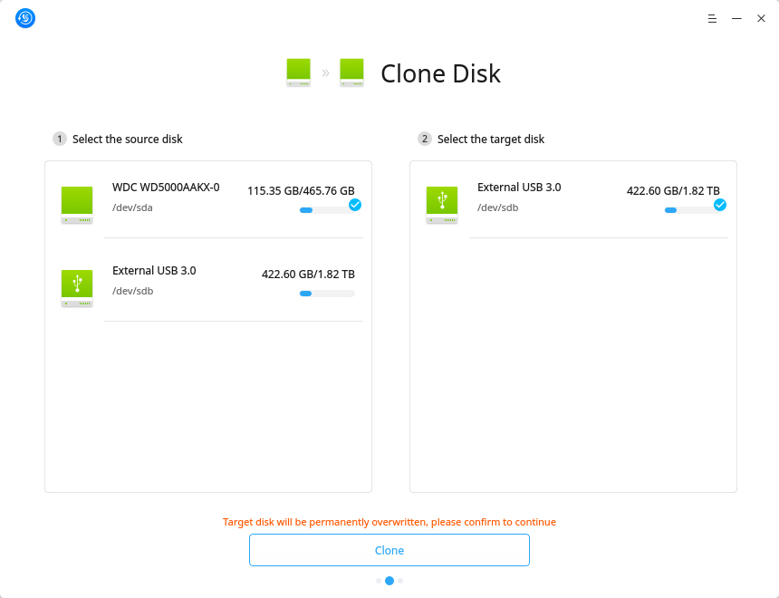
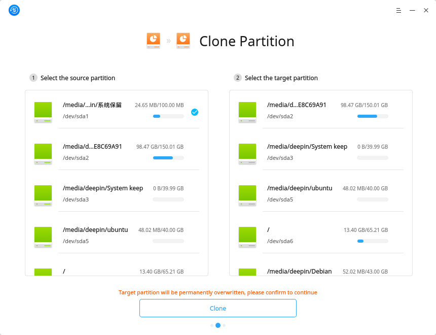
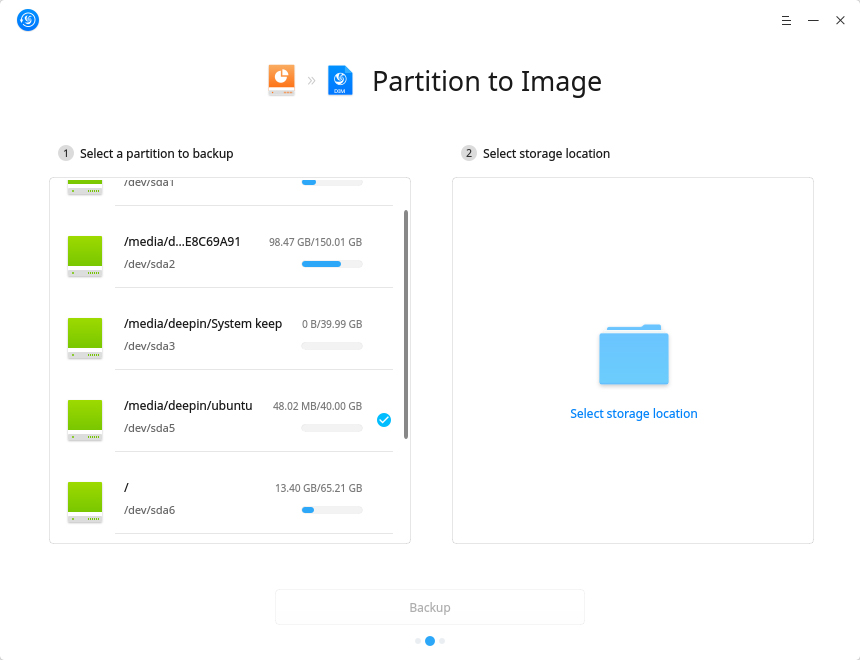
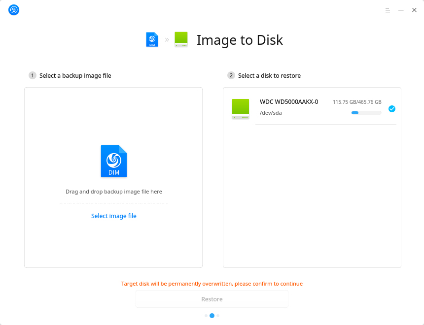
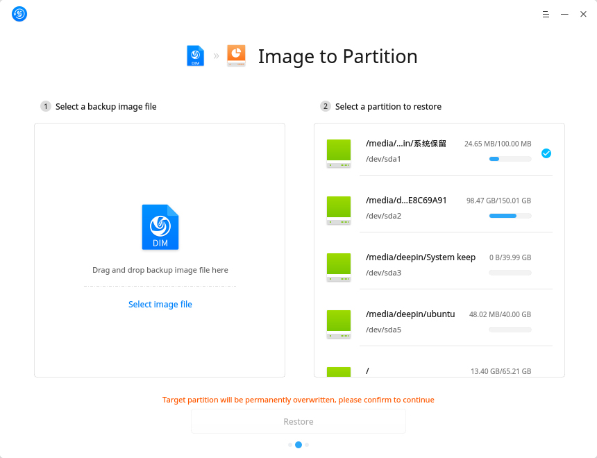

# GXDE Clone |../common/deepin-clone.svg|

## Overview
GXDE Clone is a powerful backup and restore tool in deepin. You can freely clone, backup and restore between disks or partitions. With GXDE Clone, don't worry about data loss any more!

## Common Operations

### Clone Disk
1. On GXDE Clone interface, click on  and .
2. Click on **Next** to enter Clone Disk interface.
3. Select the source disk and target disk.
4. Click on **Clone** to enter the Warning interface, click on **OK** to view the clone process.
5.  will be shown, if clone successfully, click on **OK** to exit.

> :  will be shown, if clone failed, click on **Retry** to try again.

### Clone Partition
1. On GXDE Clone interface, click on  and .
2. Click on **Next** to enter Clone Partition interface.
3. Select the source partition and target partition.
4. Click on **Clone** to enter the Warning interface, click on **OK** to view the clone process.
5.  will be shown, if clone successfully, click on **OK** to exit.

> :  will be shown, if clone failed, click on **Retry** to try again.

### Backup Disk to Image
1. On GXDE Clone interface, click on  and .
2. Click on **Next** to enter Disk to Image interface.
3. Select the disk to backup and storage location.
4. Click on **Backup** to view the backup process.
5.  will be shown, if backup successfully, click on **View Backup File** to view the image file.

> :  will be shown, if backup failed, click on **Retry** to try again.

### Backup Partition to Image
1. On GXDE Clone interface, click on  and .
2. Click on **Next** to enter Partition to Image interface.
3. Select the partition to backup and storage location.
4. Click on **Backup** to view the backup process.
5.  will be shown, if backup successfully, click on **View Backup File** to view the image file.

> :  will be shown, if backup failed, click on **Retry** to try again.

### Restore Image to Disk
1. On GXDE Clone interface, click on  and .
2. Click on **Next** to enter Image to Disk interface.
3. Select a backup image file and a disk to restore.
4. Click on **Restore** to enter the Warning interface, click on **OK** to view the restore process.
5.  will be shown, if restore successfully, click on **Restart** to restart the system.

> :  will be shown, if Restore failed, click on **Retry** to try again.

### Restore Image to Partition
1. On GXDE Clone interface, click on  and .
2. Click on **Next** to enter Image to Partition interface.
3. Select a backup image file and a partition to restore.
4. Click on **Restore** to enter the Warning interface, click on **OK** to view the restore process.
5.  will be shown, if restore successfully, click on **Restart** to restart the system.

> :  will be shown, if Restore failed, click on **Retry** to try again.

### Deepin Recovery
You need to restart and enter "Deepin Recovery" to continue next operations, if:
- The source disk or partition and target disk or partition is where the system installed in.
- The image file is stored in the disk or partition where system installed in.
- The storage location is disk or partition where system installed in.
- The disk or partition to restore is where the system installed in.

The system will restart and enter Deepin Recovery after clicking on **Restart to Continue**, then you can continue to do next operations on GXDE Clone.

## Main Menu

### Help
You can click on **Help** to view the manual.

1. On GXDE Clone interface, click on  in the top right corner.

2. Click on **Help** to view the manual.

### About
You can click on **About** to view the introduction of GXDE Clone.

1. On GXDE Clone interface, click on  in the top right corner.

2. Click on **About** to view the introduction.

### Exit

You can click on **Exit** to exit GXDE Clone.

1. On GXDE Clone interface, click on  in the top right corner.

2. Click on **Exit** to exit.

