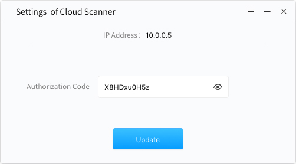
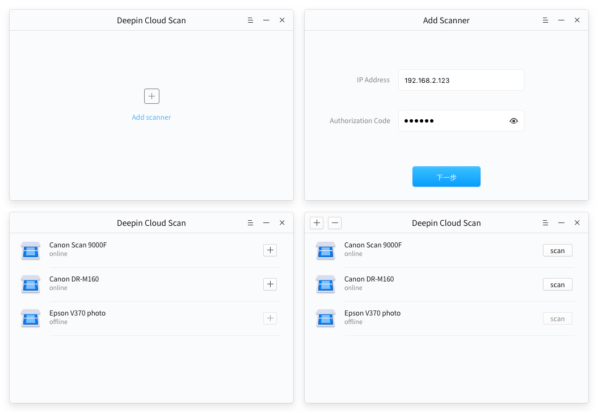
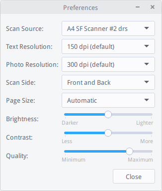

# GXDE Cloud Scan|../common/deepin-cloud-scanner.svg|

## Overview

GXDE Cloud Scan is a new scanning technology developed by Wuhan Deepin Technology Co., Ltd.. It will connect your scanner to the network, and is enabled for network scanning via daily used applications. GXDE Cloud Scan is suitable for desktops, laptops, tablets and other networking devices that you have authorized to scan.

GXDE Cloud Scan consists of server and client. Server is installed in Windows and Client is preinstalled in deepin.

## Server Configuration

You can install the server in Windows and configure the authorization code for client.

### Install Server

DeepinCloudScanServerInstaller_1.0.0.1.exe is the installation program of server, you can install it by the following steps:

1. Get the installation program of server.
2. Install it in Windows.
3. Finish the installation by wizard.

### Configure Server

Open the server from the start menu in Windows, then you can see the the interface of cloud scanner settings.

: IP address and authorization code are automatically displayed in the interface. If you want to update the authorization code, please set by the following steps:

1. Input a new authorization code.
2. Click on , the button will be grey after updated successfully.

: There is a context menu of server in the lower right corner of Windows. You can click here to configure, view "About" info or exit.

## Client Configuration

The client of GXDE Cloud Scan is preinstalled in deepin ISO. 

### Open Client

1. Click on  to enter launcher.
2. Click on  to open the "Add Scanner" interface.

### Configure Client

1. On the "Add Scanner" interface, input the IP address and authorization code from the Server in Windows.
2. Click on  to show all scanners from Windows.
3. Click on  to add the scanner, and then its status will be displayed in "Added".

: 
- Please close the firewall before enter the IP address, or IP address may be invalid.
- If you need to delete the scanner, selected the scanner and click on  to delete.

 

## Settings 

### About

You can click "About" to view the introduction of GXDE Cloud Scan.

1. On "Add scanner" interface, click on .
2. Click on **About**.
3. View the version and introduction of GXDE Cloud Scan.

### Help

You can click "Help" to read the manual, which will help you further know and use GXDE Cloud Scan.

1. On "Add scanner" interface, click on .
2. Click on **Help**.
3. View the manual of GXDE Cloud Scan.

### Exit

You can click "Exit" to exit GXDE Cloud Scan.

1. On "Add scanner" interface, click on .
2. Click on **Exit**.

: You can also click on 
on "Add scanner" interface to exit.

## Scan Test

You can use GXDE Cloud Scan to scan files in deepin, the steps are as below.

1. Click on  to enter the interface of scan settings.
2. Click the top left corner to select **Preferences** to set the scanning parameters.
3. Click **Scan** to scan.

 

: If authorization code has been updated in Windows, when you are scanning a file, there will be a prompt of "The authorization code of cloud scan sever has been updated, please input a new authorization code". Please contact the administrator to get a new one to scan. If errors occurred during scanning, please reset according to the errors.
