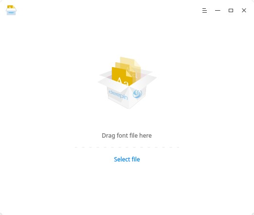
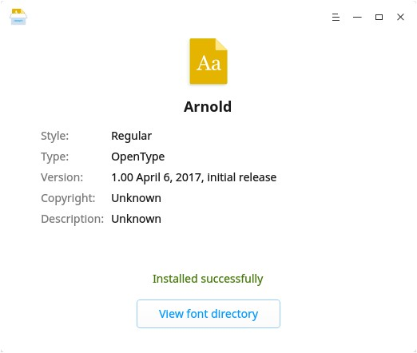
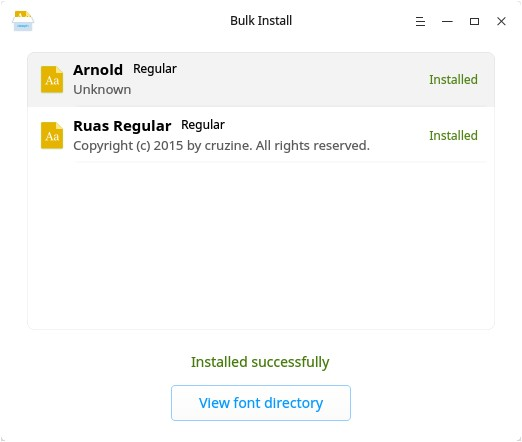
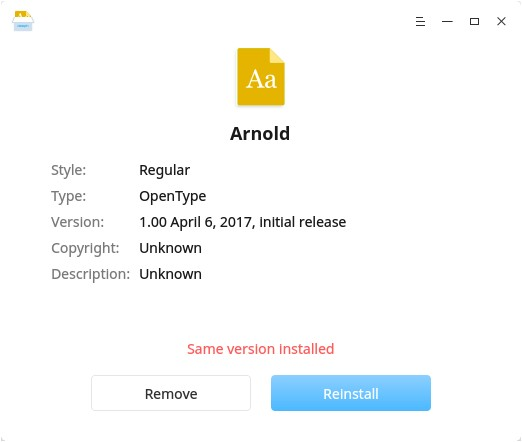

# GXDE Font Installer |../common/deepin-font-installer.svg|

## Vistazo

GXDE Font Installer es una aplicación que ayuda a los usuarios a instalar y desinstalar fácilmente archivos de fuentes, admite la instalación masiva y la vista previa de fuentes.

## Operaciones básicas

### Iniciar GXDE Font Installer

Puede iniciar GXDE Font Installer de dos formas:

- Right clic en un archivo de fuente y seleccione **Abrir con** > **GXDE Font Installer**, la aplicación se iniciará mostrará la información de la fuente.
- Haga clic en  en el Lanzador para iniciar GXDE Font Installer.

### Instalar fuente
Puede instlar una o varios archivos de fuentes en el momento.

#### Instalación simple

1. En la interfaz de GXDE Font Installer, clic en **Seleccionar archivo** o arrastre y suelte para abrir el archivo de fuente. La información de la fuente será mostrada.
2. Haga clic en **Instalar** para continuar.
3. Ingrese la credencial de administrador y pulse **Confirmar**.
4. La fuente es instalada con éxito. Puede hacer clic en **Ver directorio de la fuente** para abrirlo.
5. Haga clic en  **Aceptar** para finalizar.

> : GXDE Font Installer automáticamente dectecta las fuentes, si está instalado, este muestra "Misma versión instalada" u "Otra versión instalada", después puede escoger **Quitar** o **Reinstalar** para continuar.

#### Instalación en lote

Arrastre y suelte archivos de fuentes o seleccione varias fuentes a la vez para iniciar la instalación de lote. Los pasos son los mismos que en la [Instalación simple](#Instalación simple).

:

- Incluso otras fuentes ya están instaladas, aún puede arrastrar el archivo de fuentes para instalar.
- El estado de la instalación se mostrará a la derecha de cada fuente, indicando si está instalada, por instalar o tuvo un error.
- Haga clic en  a la derecha de cada fuente para eliminarla de la lista.
- Si muestra "otra versión instalada", haga clic en "Instalar", su nueva versión se instalará para reemplazar la versión anterior.

> : Si desea usar una fuente instalada como fuente del sistema, abra el **Centro de Control**, clic **Fuentes** en **Personalización**, y establece la fuente como **Fuente estándar**.

### Remover fuentes

1. En la interfaz de GXDE Font Installer, clic en **Seleccionar archivo** para abrir el archivo de fuente instalado, o haga doble clic en la fuente instalada para iniciar GXDE Font Installer.

2. Haga clic en **Quitar**, ingrese las credenciales de administrador y haga clic en **Confirmar**.

3. Haga clic en **Aceptar** para salir.

### Ejecutar con el Gestor de archivos ###

Puede previsualizar y abrir la fuente directamente en el Gestor de archivos Deepin.

- Seleccione el archivo de la fuente en el Gestor de archivos, pulse la tecla **Espacio**, la ventana de previsualización se abrirá y mostrará el estilo de la fuente.
- Seleccione el archivo de la fuente en el Gestor de archivos, haga clic derecho y escoga clic derecho y seleccione **Abrir con** > **GXDE Font Installer**.

## Menú principal

### Ayuda

Puede hacer un clic para ver el manual, que le ayudará a conocer y usar el instalador de fuentes de Deepin.

1. En la la interfaz de GXDE Font Installer, clic en  .
2. Clic en **Ayuda**.
3. Observe el manual.

### Acerca de

Puede hacer clic para ver la descripción de la versión.

1. En la la interfaz de GXDE Font Installer, clic en .
2. Seleccione **Acerca de**.
3. Observe la descripción de la versión.

### Salir

Puede hacer clic para salir del Creador de arranque de Deepin.

1. En la la interfaz de GXDE Font Installer, clic en .
2. Clic en **Salir** para cerrar.
